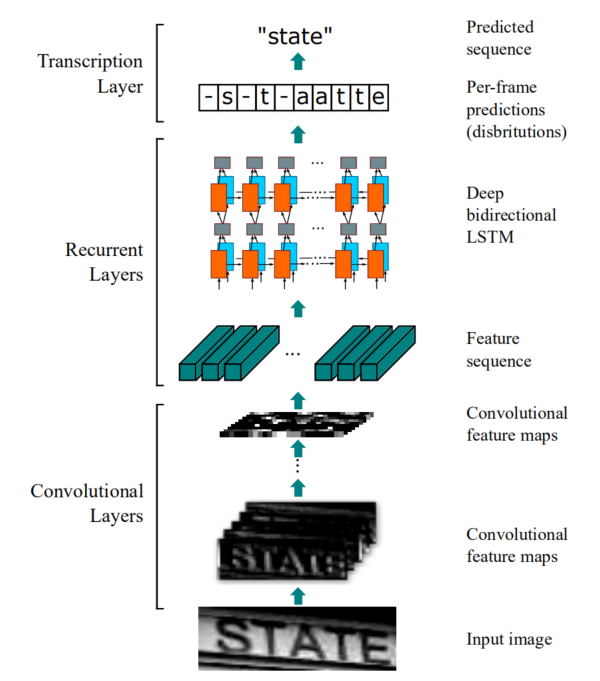
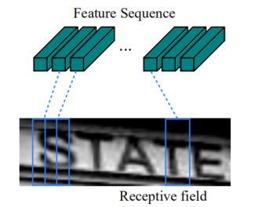
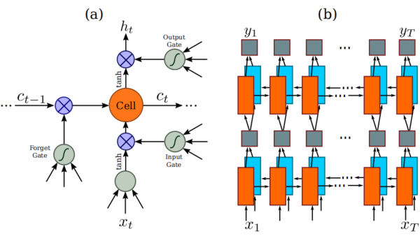

<h1 id='PANet'>CRNN</h1>

>## 目录
+ [CRNN简介](#Abstract)  
+ [相关介绍](#Introduction)  
+ [网络架构](#TheProposedNetworkArchitecture)
   + [1.特征序列提取](#FeatureSequenceExtraction)
   + [2.序列标记](#SequenceLabeling)
   + [3.转录](#Transcription)
     + [3.1 标签序列的概率](#Probabilityoflabelsequence) 
     + [3.2 无词典转录](#Lexicon-freetranscription)
     + [3.3 基于词典转录](#Lexicon-basedtranscription)
     + [3.4 网络训练](#NetworkTraining)

><h2 id='Abstract'>CRNN简介</h2>
[CRNN](https://arxiv.org/pdf/1507.05717.pdf)是一种将特征提取、序列建模和转录集成到统一框架中的新型神经网络结构。相比于之前的网络，该体系结构具有四个独特的特性：
+ 它是端到端可训练的，与大多数现有的算法相比，它们的组件是单独训练和调优的。
+ 它自然地处理任意长度的序列，不涉及字符分割或水平尺度归一化。
+ 它并不局限于任何预定义的词汇，并且在无词典(lexicon-free)和基于词典( lexicon-based)的场景文本识别任务中都取得了显著的性能。
+ 它生成了一个有效但小得多的模型，这对于现实应用场景更实用。
  
><h2 id='Introduction'> 相关介绍 </h2>
神经网络获得了强劲的复兴，这主要是受到深度深经网络、特别是深度卷积神经网络(Deep
Convolutional Neural Networks, DCNN)在各种视觉任务中的巨大成功。然而，最近大多数关于深度神经网络的工作都致力于对象类别的检测或分类。本文讨论了计算机视觉中的一个经典问题：基于图像的序列识别。图像文本识别与一般文本识别有几点不同：
+ 识别这类类似序列的对象通常需要系统预测一系列对象标签，而不是单个标签。因此，对这些对象的识别可以很自然地转化为一个序列识别问题。
+ 类序列对象的另一个独特特性是，它们的长度可能会有很大的变化。
  
有人尝试为特定的类似序列的对象解决这个问题，这种方法通常需要训练一个强字符检测器，以准确地检测和从原始单词图像中裁剪每个字符。其他一些方法将场景文本识别视为图像分类问题，并为每个英语单词分配一个类标签。它得到了一个具有大量类的大型训练模型，很难推广到其他类型的序列类对象，如中文文本、乐谱等，因为这类序列的基本组合的数量可以超过100万。递归神经网络(Recurrent neural networks, RNN)，主要是被设计用于处理序列的模型。RNN的优点之一是，它在训练和测试中都不需要序列对象图像中每个元素的位置。但是预处理中一个重要的步骤是转化输入对象图像到一系列图像特征中。预处理步骤独立于流程的后续组件，因此基于RNN的现有系统不能以端到端的方式进行训练和优化。  
本文主要贡献是提出新的神经网络模型，其网络结构是专门为识别图像中的类序列对象而设计的被命名为卷积递归神经网络(Convolutional Recurrent Neural Network, CRNN)，因为它是DCNN和RNN的组合。他有以下几个优点：
+ 它可以直接从序列标签学习，不需要详细的注释。
+ 它在直接从图像数据中学习信息表示方面具有与DCNN相同的特性，既不需要手工特征，也不需要预处理步骤，包括二值化/分割、组件定位等。
+ 它具有与RNN相同的属性，能够产生一系列的标签。
+ 它不受类序列对象长度的限制，只需要在训练和测试阶段进行高度标准化。
+ 它在场景文本（文字识别）上比现有的技术取得了更好的或具有高度竞争力的性能。
+ 它包含的参数比标准的DCNN模型要少得多，消耗了更少的存储空间。

><h2 id='TheProposedNetworkArchitecture'>网络架构</h2>

CRNN的网络架构由三个组件组成，包括卷积层、循环层和转录层。在CRNN的底部，卷积层自动从每个输入图像中提取一个特征序列。在卷积网络的基础上，建立了一个循环网络，对由卷积层输出的特征序列的每一帧进行预测。转录层在CRNN的顶部，将循环层的每帧预测转换为一个标签序列。虽然CRNN是由不同类型的网络架构组成的。CNN和RNN)，它可以用一个损失函数联合训练。

<h3 id='FeatureSequenceExtraction'>1.特征序列提取</h3>

在CRNN模型中，卷积层的组件是通过从标准CNN模型中提取卷积和最大池积层（去除全连接层），该组件用于从输入图像中提取顺序的特征表示。在被输入网络之前，所有的图像都需要缩放到相同的高度。递归层的输入是卷积层的组件生成的特征图中提取特征向量序列。具体来说，特征序列的每个特征向量在特征图上从左到右一列生成，这意味着第$i$个特征向量是所有映射的第$i$个列的连接。在我们的设置中，每一列的宽度都固定为单个像素。因此，特征映射的每一列都对应于原始映射的一个矩形区域图像，这个矩形区域叫做接受域(receptive field)。这些矩形区域从左到右与特征图上相应列的顺序相同，每个向量都与一个接受域相关联，可以作为该区域的图像描述符。

以前的一些方法使用CNN来学习类似场景文本的序列对象的鲁棒表示。但这些方法通常通过CNN提取整个图像的整体表示，然后收集局部深度特征来识别序列状对象的每个组成部分。由于CNN要求输入图像缩放到固定的大小以满足其固定的输入尺寸，由于长度变化大，不适合于类似序列的对象。在CRNN中，我们将深度特征传递为序列表示，以便对类序列对象的长度变化不变。

<h3 id='SequenceLabeling'>2.序列标记</h3>

一个深度双向递归神经网络建立在卷积层的顶部，作为递归层。这些递归层为每帧中来自$X=x_1,\cdots ,x_T$的$x_t$预测一个标签分布$y_t$。循环层的优点有三方面：
+ RNN具有捕获序列中的上下文信息的强大能力。使用上下文线索进行基于图像的序列识别比独立处理每个符号更稳定、更有帮助。
+ RNN可以将错误差分反向传播到其输入中，即卷积层中。允许我们在一个统一的网络中联合训练循环层和卷积层。
+ RNN能够对任意长度的序列进行操作，从开始遍到结束。    
  
传统的RNN单元在其输入层和输出层之间有一个自连接的隐藏层，每次它收到序列中的一帧${x_t}$时，它都会用一个非线性函数更新其内部状态${h_t}$，该函数将当前输入${x_t}$和过去状态${h_{t-1}}$作为输入：$h_t=g(x_t,h_{t-1})$。然后基于${h_t}$进行预测${y_t}$.这样，就可以捕获过去的上下文${\{x_{t^{\prime}}LSTM\}}t^\prime<t$并用于预测。但传统的RNN单元存在梯度消失问题，这限制了它可以存储的上下文的范围，并增加了训练过程的负担。长期短期记忆(Long-Short Term Memory, LSTM)是一种专门为解决这个问题而设计的RNN单元。一个LSTM由一个存储单元和三个乘法门组成，即输入、输出和遗忘门。从概念上讲，内存单元格存储过去的上下文，并且输入和输出门允许单元格长时间存储上下文。同时，单元格中的记忆可以被遗忘门清除。LSTM的特殊设计允许它捕获远程依赖关系，这通常发生在基于图像的序列中。LSTM是有方向性的，它只使用过去的上下文。然而，在基于图像的序列中，来自两个方向的上下文是有用的和相互互补的。因此，我们遵循[(Speech recognition with deep recurrent neural networks)](https://arxiv.org/pdf/1303.5778.pdf)，将两个LSTM，一个向前，一个向后组合成一个双向LSTM。此外，多个双向LSTM可以堆叠，从而产生深度双向LSTM。深度结构比浅层结构允许更高层次的抽象，并在语音识别任务中取得了显著的性能提高。

在循环层中，误差差沿箭头的相反方向传播，随着时间反向传播(Back-Propagation Through Time, BPTT)。在循环层的底部，将传播的差分序列连接成映射，反转将特征映射转换为特征序列的操作，并反馈给卷积层。在实践中，我们创建了一个自定义的网络层，称为“映射到序列”(Map-to-Sequence)，作为卷积层和递归层之间的桥梁。

<h3 id='Transcription'>3.转录</h3>

转录是将RNN的每帧预测转换为标签序列的过程。在数学上，转录是为了在每帧预测的条件下寻找概率最高的标签序列。在实践中，存在两种转录模式，即无词汇的转录模式和基于词汇的转录模式。词典是一组标签序列，预测是约束。在无词汇模式下，预测是通过没有任何词汇来进行的。在基于词汇的模式下，通过选择概率最高的标签序列进行预测。

<h4 id='Probabilityoflabelsequence'>3.1 标签序列的概率</h4>

我们采用在连接主义时间分类(Connectionist Temporal Classification, CTC)层中定义的条件概率。根据每帧预测的条件，定义了标签序列$l$的概率$\gamma = y_1,\cdots,y_T$，并且它忽略了$l$中的每个标签所在的位置.因此，当我们使用这个概率的负对数似然作为训练网络的目标时，我们只需要图像及其相应的标签序列，避免了单个字符的标记位置的劳动。  
条件概率的公式被简要地描述如下：输入是一个序列$\gamma=y_1,\cdots,y_T$，其中$T$是序列的长度。每个$y_t\in R^{L ^\prime}$是在集合$L^\prime=L \cup$上的概率分布.其中，$L$包含任务中的所有标签。序列到序列(sequence-to-sequence)映射函数$\Beta$上定义了序列$π∈L^{\prime T}$，其中T为长度.$\Beta$通过首先删除重复的标签，然后删除“空白”，将$π$映射到$l$上。然后，将条件概率定义为由$B$映射到$l$上的所有$π$的概率之和：
$$p(l|y)=\sum_{π:\Beta(π)=1}p(π|y)$$
其中，$π$的概率被定义为$p(π|y)=\prod_{t=1}^Ty^t_{π_t}$,$y^t_{π_t}$是在时间戳$t$上有标签$π_t$的概率。直接计算总和数目由于公式指数数较大，在计算上是不可行的。然而，公式可以使用中描述的前向-向后算法有效地计算。

<h4 id=' Lexicon-freetranscription'>3.2 无词典转录</h4>

在这种模式下，如公式中定义的概率最高的序列$l^∗$作为预测,由于没有可处理的算法来精确地找到解。我们使用了在[ Connectionist temporal classification: labelling unsegmented sequence data with recurrent neural networks](https://dl.acm.org/doi/10.1145/1143844.1143891)中的策略。序列$l^∗$近似是由$l^*\approx \Beta(argmax_πp(π|y))$在每个时间戳$t$上取最可能的标签$π_t$，并将结果序列映射到$l^∗$上。

<h4 id='Lexicon-basedtranscription'>3.3 基于词典转录</h4>

在基于词汇的模式下，每个测试样本都与一个词汇$D$相关联。基本上，标签序列是通过选择词典中定义的最高条件概率的序列来识别的$l^*= argmax_{l \in D}p(π|y)$。然而，对于大的词典，对词典进行详尽的搜索将是非常耗时的。无词汇转录预测的标签序列通常接近于编辑距离度量下的标准量，这表明我们可以将搜索限制在最近邻候选$N_\delta(l^\prime)$。其中$δ$为最大编辑距离，$l^\prime$为在无词典模式下从$y$转录的序列：
$$l^*=arg\underset {l \in N_\delta(l^\prime)} {max}p(l|y)$$
利用BK树的数据结构，可以有效地找到候选的$N_\delta(l^\prime)$,这是一种专门适应于离散度量空间的度量树。BK树的搜索时间复杂度为$O(\log|D|)$，其中$|D|$是标签大小。因此，这个方案很容易扩展到非常大的词汇。

<h4 id='NetworkTraining'>3.4 网络训练</h4>

用$X=\{I_i，l_i\}_i$表示训练数据集，其中$I_i$为训练图像，$l_i$为地面真值标签序列。目的是最小化标准值的条件概率的负对数似然：
$$O=-\sum _{I_i,l_i \in X}\log p(l_i|y_i)$$
其中$y_i$是$I_i$的循环和卷积层产生的序列。这个目标函数直接从图像及其标准标签序列计算成本值。因此，网络可以对图像和序列进行端到端训练，消除了在训练图像中手动标记所有单个组件的过程。
采用随机梯度下降( stochastic gradient descent， SGD)训练网络。梯度由反向传播算法计算。特别是，在转录层，误差差分通过前向-反向算法进行反向传播，如[Connectionist temporal classification: labelling unsegmented sequence data with recurrent neural networks](https://dl.acm.org/doi/10.1145/1143844.1143891)所述。在循环层中，采用时间反向传播(Back-Propagation Through Time， BPTT)计算误差差。
为了优化，我们使用ADADELTA来自动计算每维的学习率。与传统的动量方法相比，ADADELTA不需要手动设置学习速率。更重要的是，我们发现使用ADADELTA的优化比动量方法收敛得更快。