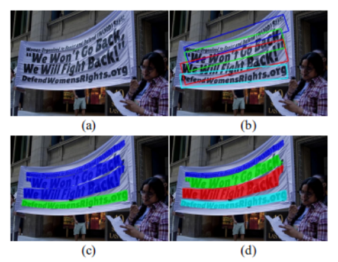
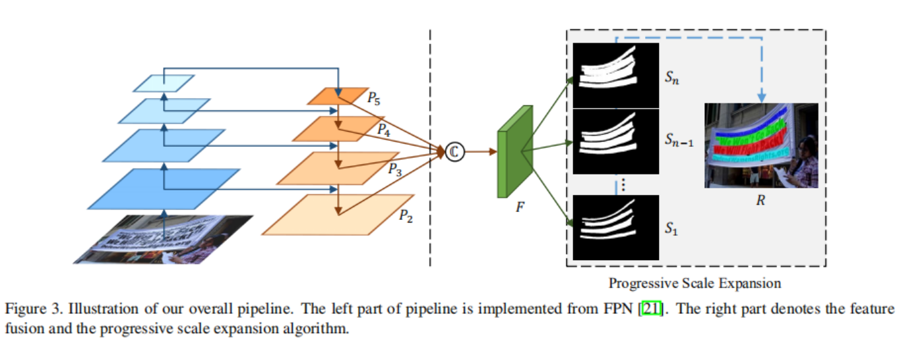
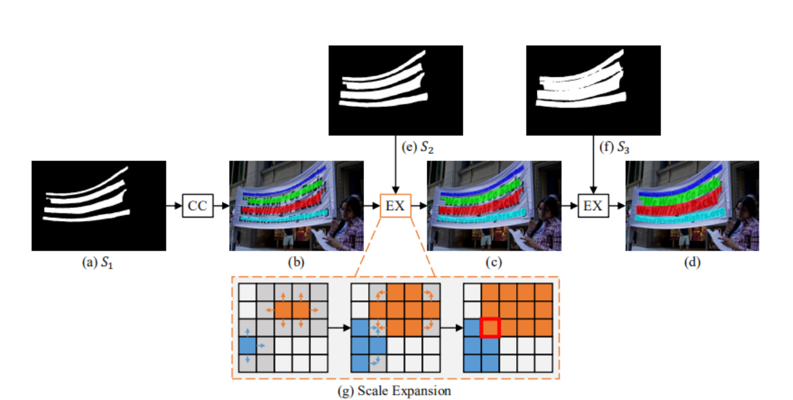
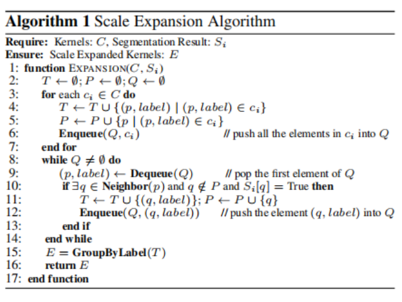

<h1 id='PSENet'>PSENet</h1>

>## 目录
+ [PSENet简介](#Abstract)
+ [相关介绍](#Introduction)
+ [相关方法](#ProposedMethod)
    + [总体结构](#OverallPipeline)
    + [网络设计](#NetworkDesign)
    + [渐进式尺度扩展算法](#ProgressiveScaleExpansionAlgorithm)
    + [标签生成](#LabelGeneration)
    + [损失函数](#LossFunction)

><h2 id='Abstract'> PSENet简介 </h2>  
[PSENet](https://arxiv.org/pdf/1903.12473.pdf) 全称为Progressive Scale Expansion Network，即渐进式规模扩展网络，它通过为每个文本实例来生成不同规模的kernel，然后逐渐从最小规模的kernel扩展到具有完整形状的文本实例，从而实现对不规则文本实例的精确识别。  

图中为不同方法实现的的结果，(a)是原始图像，(b)是基于回归的方法实现的结果，(c)是基于朴素语义分割实现的结果，(d)是PSENet的结果。可以明显发现基于PSENet实现的的图像文本检测要比上述的两种方法的检测精准度都要高。

> <h2 id='Introduction'> 相关介绍 </h2>
在图像文本检测领域大部分使用的是基于卷积神经网络(Convolutional Neural Networks, CNN)的方法，我们将现存的基于CNN算法分为两类：一类是基于回归的方法(regression-based approaches)，另一类是基于分割的方法(segmentation-based approaches)。
+ 基于回归的方法：文本目标通常是以具有特定方向的矩形或者四边形的形式表示，但是基于回归的方法不能处理任意形状的文本实例。
+ 基于分割的方法：文本目标是基于像素级分类来定位文本实例，但是基于分割的方法很难分离彼此接近的文本实例。  

为此，提出一种基于kernel的框架，即渐进式规模扩展网络(PSENet)。PSENet是基于分割的方法，对于文本实例采取像素级分割，能够精准定位任意形状的文本实例。另外，为解决基于分割方法难以分离接近的文本实例的问题，PSENet采取一种渐进式尺度扩展算法，可以成功实现识别相邻的文本实例。具体方法是将每个文本实例分割为多个预测分割区域，将这些分割区域叫做“kernel”，然后采取一种基于广度优先搜索(BFS)的渐进式尺度扩展算法。主要有三步：
+ 从具有最小比例的kernel开始
+ 通过逐渐在kernel中加入更多的像素来扩大他们的区域
+ 直到探索到完整的文本实例后结束  

渐进式尺度算法的设计能够实现的主要原因是：
+ 具有最小尺度的kernel很容易分离，因为它们之间边界相距很远
+ 最小规模的kernel不能覆盖整个文本实例的完整区域，有必要从最小规模的内核中恢复完整的文本实例
+ 渐进式尺度扩展算法是将小内核扩展到完整的文本实例的一种简单而高效的方法，它确保了文本实例的准确位置
  
> <h2 id='ProposedMethod'> 相关方法 </h2>

<h3 id='OverallPipeline'>1. 总体流水线</h3>

使用ResNet作为主干网络，获得低级文本特征与高级语义特征。将这些转化为图后在F中进一步融合，这种融合可促进不同尺度kernel的生成。然后将特征图$F$投影到n个分支中，得到n个分割结果$S_1,S_2,\cdots,S_n$,每个$S_i$都会是一定规模上所有文本实例的一个分割掩码。这些掩码中$S_1$给出了规模最小的文本实例的分割结果，$S_n$会获得原始分割掩码(即最大kernel),我们会使用渐进式尺度扩展算法将$S_1$逐渐扩展到$S_n$的完整形状，并且获得最终的检测结果$R$。

<h3 id='NetworkDesign'>2. 网络设计</h3>

基础网络结构采取特征金字塔网络(Feature Pyramid Networks, FPN),首先得到了4个256个通道的特征图(例如$P_2、P_3、P_4、P_5$)。为了进一步结合从低到高级的语义特征，我们通过函数$C(\cdot)$融合得到具有1024个通道的特征映射$F$
$$\begin{aligned}
F & = C(P_2,P_3,P_4,P_5) \\
& =P_2||Up_{\times 2}(P_3)||Up_{\times 4}(P_4)||Up_{\times 8}(P_5)
\end{aligned}$$

其中$||$表示连接，$Up_ {\times2}(\cdot)$、$Up_ {\times4}(\cdot)$、$Up_ {\times8}(\cdot)$分别表示2、4、8次上采样。然后将F送入Conv(3,3)-BN-ReLU层并且减少到256个通道。然后通过n个Conv(1,1)-Up-Sigmoid层,产生n个分割结果$S_1,S_2,\cdots,S_n$。

<h3 id='ProgressiveScaleExpansionAlgorithm'>3. 渐进式尺度扩展算法</h3>

如上图所示，我们有三个分割结果$S={S_1,S_2,S_3}$,首先基于最小的kernel图$S_1$，四个不同的连接组件$C={C_1,C_2,C_3,C_4}$可以作为初始化被找到。这样我们就检测到了所有文本实例的中心部分(即最小的kernel)。随后我们通过合并$S_2$，$S_3$中的像素，逐步扩展检测到的kernel。尺度的扩展方式如(g)，这种扩展基于广度优先算法(Breadth-First-Search, BFS),该算法从多个核的像素开始，并迭代合并相邻的文本像素。在合并像素时有可能会出现存在冲突的像素，如(g)中红框所示。这时采取先到先得的原则，即混淆的像素只能由先到先得的一个kernel合并。因此这些边界冲突并不会影响最终的检测与性能。

上图展示了尺度扩展算法实现的细节，在伪代码中$T,P$都是中间结果，$Q$是队列，$Neighbor(\cdot)$代表$p$的四路邻域像素，$GroupByLabel(\cdot)$是按标签对中间结果进行分组的功能。“$S_i[q]=True$”表示$S_i$中像素$q$的预测值属于文本部分。$C$和$E$分别用于在扩张前后保持内核。

<h3 id='LabelGeneration'>4. 标签生成</h3>

因为PSENet生成的分割结果有不同的kernel尺度，所以训练时需要相对应的不同尺度的kernel的标准标签。本文采用通过缩小原始文本实例来获得标准标签，具体来说使用Vatti剪辑算法(the Vatti clipping algorithm)将原始多边形$p_n$缩小$d_i$个像素，得到收缩多边形$p_i$.然后将每个收缩的多边形$p_i$被转移到一个用来分割标准标签的0/1二进制掩码。我们将这些标准图分别表示为$G1、G2、...，Gn$,如果我们把比例设为$r_i$，$p_n$和$p_i$之间的距离$d_i$可以表示为：
$$d_i={{Area(p_n)}\times{(1-r^2_i)}\over{Perimeter(p_n)}}$$
其中$Area(\cdot)$是计算多边形面积的函数，$Perimeter(\cdot)$是计算多边形周长的函数。我们将标准图$G_i$的比例比$r_i$定义为:
$$r_i=1-{{(1-m)\times{(n-i)}}\over{(n-1)}}$$
其中$m$是最小比例比，这是$(0,1]$中的一个值。基于上述方程式中的定义，比例的值(例如$r1、r2、...，rn$)由两个超参数$n$和$m$决定，它们从$m$线性增加到1。

<h3 id='LossFunction'>5. 损失函数</h3>

PESENet的损失函数可以表示为：
$$L={\lambda}L_c+(1-{\lambda})L_s$$
其中，$L_c$和$L_s$分别表示完整文本实例和收缩实例的损失，而$\lambda$平衡了$L_c$和$L_s$之间的重要性。
当使用二进制交叉熵时，由于在自然图像中，文本实例通常只占据一个非常小的区域，所以使用网络与测试可能会出现预测非文本区域的偏差。受到[V-Net: Fully Convolutional Neural Networks for Volumetric Medical Image Segmentation](https://arxiv.org/pdf/1606.04797.pdf)启发，采取骰子系数(dice coefficient)的方法。该方法$D(S_i,G_i)$可以表示为:
$$D(S_i,G_i)={{2\sum}_{x,y}(S_{i,x,y}\times G_{i,x,y})\over{\sum}_{x,y}S^2_{i,x,y}+{\sum}_{x,y}G^2_{i,x,y}}$$

其中，$S_{i,x,y}$和$G_{i,x,y}$分别表示分割结果$S_i$和标准值$G_i$中的像素$(x、y)$的值。此外，还有许多类似于文本笔画的模式，如fences, lattices等。因此，我们在训练过程中采用在线硬例挖掘([Online Hard Example Mining，OHEM](http://proceedings.mlr.press/v28/sutskever13.html))的到$L_c$，以更好地区分这些模式。$L_c$专注于分割文本和非文本区域。让我们将OHEM给出的训练掩模考虑为$M$，从而可以表示$L_c$为：
$$L_c=1-D(S_n\cdot M, G_n\cdot M)$$
$L_s$是指已缩小的文本实例的损失。由于它们被完整文本实例的原始区域所包围，我们忽略了分割结果$S_n$中非文本区域的像素，以避免一定的冗余。因此，可以表述如下：
$$L_s=1-{{\sum}_{i=1}^{n-1}D(S_i\cdot W, G_i\cdot W)\over n-1}$$
$$ W_{x,y} =\left\{
\begin{aligned}
\quad &1, \quad if \ S_{n,x,y}\geq 0.5;\\
&0,  \quad otherwise.  \\
\end{aligned}
\right. $$
在这里，$W$是一个掩码，它忽略了$S_n$中的非文本区域的像素，而$S_{n,x,y}$是指$S_n$中的像素$(x,y)$的值